<h1 align="center">Лабораторна робота №8</h1>
<h3 align="center">Discrete Log Problem<br>Дискретний логарифм та вплив параметрів групи на складність пошуку</h3>

<p align="center">
  <a href="https://github.com/RE22GDV/LR8-DiscreteLog/actions/workflows/ci.yml"></a>
  
  
  
  
  
</p>

> Дисципліна: Захист даних · Тема: асиметрична криптографія, дискретний логарифм, ElGamal
> Задача: [CodinGame — Discrete Log Problem](https://www.codingame.com/training/hard/discrete-log-problem), Hard

Два модулі однакової довжини можуть мати дуже різну складність дискретного логарифма. У роботі це перевірено реальними вимірюваннями BSGS, повного перебору, Полларда та Поліга—Геллмана, а також відновленням навчального повідомлення ElGamal.

Результат CodinGame: 100% після відправлення рішення 06.10.2026. Скріншоти коду, чотирьох успішних видимих тестів і підсумкової оцінки наведено в [розділі перевірки](#5-перевірка-розвязку).

---

## Зміст

1. [Постановка задачі](#1-постановка-задачі)
2. [Математика та алгоритми](#2-математика-та-алгоритми)
3. [Структура репозиторію](#3-структура-репозиторію)
4. [Запуск](#4-запуск)
5. [Перевірка розв’язку](#5-перевірка-розвязку)
6. [Обчислювальні експерименти](#6-обчислювальні-експерименти)
7. [Відновлення ElGamal](#7-відновлення-elgamal)
8. [Висновки та межі застосовності](#8-висновки-та-межі-застосовності)
9. [Відтворення результатів](#9-відтворення-результатів)
10. [Список використаних джерел](#10-список-використаних-джерел)

---

## 1. Постановка задачі

У задачі Discrete Log Problem відкритий ключ подано трьома цілими числами G, H і Q. Число Q є простим модулем, G - основою піднесення до степеня, а H отримано з невідомого приватного показника X. Потрібно знайти найменший невід’ємний показник, що відтворює H за модулем Q. Формат входу та обмеження наведено в таблиці 8.1 [1].

Таблиця 8.1 — Вхідні та вихідні дані задачі

| Величина | Значення |
| --- | --- |
| Вхід | Один рядок: G H Q |
| Вихід | Найменший показник X |
| Модуль | Q просте; 0 < Q < 50 000 000 000 |
| Обмеження умови | 1 < G, H < Q; 1 < X < Q - 1 |
| Приклад платформи | 654 4547 11087 → 114 |


Для пояснення математичних властивостей надалі використано позначення p = Q, g = G, h = H і x = X. Умова називає G генератором, проте реалізація зберігає коректність і для основ меншого порядку. Це дає змогу окремо перевірити випадки, коли показник визначається лише за модулем порядку підгрупи. Локальна бібліотека також допускає h = 1 і відповідь x = 0, хоча такі значення виходять за наведені обмеження навчальної платформи.

Дискретне піднесення до степеня та пошук логарифма є різними обчислювальними задачами. Для скінченної групи перебір завжди завершується, а для елемента породженої підгрупи логарифм існує. Криптографічний інтерес становить вартість його знаходження за великих і правильно вибраних параметрів. ElGamal використовує операції в такій групі. RSA має іншу математичну основу: його модуль є добутком простих чисел, а факторизація дає змогу відновити приватний ключ; загальну еквівалентність інверсії RSA та факторизації тут не стверджується [2, 6].


## 2. Математика та алгоритми


Ненульові залишки за простим модулем p утворюють мультиплікативну групу. Порядок основи g - найменше додатне число n, для якого степінь g повертається до одиниці. Усі степені періодичні з періодом n, тому пошук достатньо виконувати в одному періоді. Шукане співвідношення та область вибору показника наведено у формулі [(1)](#formula-1):

<a id="formula-1"></a>

$$
h \equiv g^x \pmod p,\quad n=\operatorname{ord}_p(g),\quad 0\le x<n\qquad\text{(1)}
$$

Якщо g є первісним коренем, то n = p - 1. Для довільної ненульової основи її порядок ділить p - 1. Наприклад, за p = 7 основа g = 4 має послідовність степенів 1, 4, 2, 1. Тому для h = 2 найменший показник дорівнює 2, а показники 5, 8 і далі дають той самий елемент. Для h = 3 розв’язку в цій підгрупі немає. Отже, довжина довільно записаного показника сама по собі не збільшує число різних відкритих значень.

У локальній бібліотеці порядок обчислюється з розкладу p - 1. Початкове n послідовно ділиться на простий множник r тоді, коли g у степені n/r дорівнює одиниці. У результаті отримується точний період степенів. Перед використанням Поліга—Геллмана переданий порядок додатково перевіряється, оскільки просте кратне порядку недостатнє для правильного розкладання задачі на компоненти.

### Повний перебір

Найпростіший алгоритм починає з одиниці й після кожної невдалої перевірки множить поточне значення на g за модулем p. Він не обчислює кожний степінь заново: наступний кандидат утворюється одним модульним множенням. Для відповіді x потрібно виконати x таких множень і x + 1 порівнянь, якщо перевіряються показники від нуля. Додаткова пам’ять містить лише поточний залишок і лічильник.

У найгіршому випадку кількість перевірок пропорційна n. Для 24-бітного експериментального модуля це вже понад вісім мільйонів послідовних кандидатів. У стенді повний перебір використано як базовий алгоритм для малих модулів і як незалежний спосіб отримання очікуваних відповідей у тестах. Якщо користувач задає ліміт спроб і він вичерпується раніше завершення циклу, повертається стан budget_exhausted. Він відрізняється від доведеної відсутності розв’язку.

### Алгоритм малих і великих кроків

Ідея BSGS полягає в поданні показника як суми великого блока та позиції всередині нього. Вибирається додатна довжина блока m. Для кожного можливого x існують цілі i і j, отримані діленням x на m з остачею. Перетворення вихідного рівняння наведено у формулі [(2)](#formula-2):

<a id="formula-2"></a>

$$
x=im+j,\quad h(g^{-m})^i\equiv g^j\pmod p\qquad\text{(2)}
$$

Спочатку будується словник малих кроків: залишок gʲ зіставляється з показником j від 0 до m - 1. Потім послідовно розглядаються великі кроки h, h·g⁻ᵐ, h·g⁻²ᵐ і далі. Збіг із ключем словника означає, що знайдено показник im + j. Після кожного великого кроку потрібне одне множення, оскільки множник g⁻ᵐ обчислюється один раз.

Модульний обернений елемент існує, бо p просте й g ненульове. У Python він обчислюється виразом pow(value, -1, p), де value після побудови словника дорівнює gᵐ за модулем p [8]. Повний код у solution/codingame_solution.py використовує тільки стандартні модулі math і sys; додаткові пакети для відправлення на CodinGame не потрібні.

Для фіксованого m обсяг таблиці пропорційний m, а число великих кроків обмежене кількістю блоків. Ці оцінки наведено у формулі [(3)](#formula-3). Вони рахують операції групи та звернення до словника; вартість довгої цілочислової арифметики й припущення про середній час доступу до словника слід враховувати окремо.

<a id="formula-3"></a>

$$
T(m)=O\!\left(m+\left\lceil\frac{n}{m}\right\rceil\right),\quad M(m)=O(m)\qquad\text{(3)}
$$

Баланс часу та пам’яті досягається поблизу квадратного кореня з точного порядку n. Вибір довжини блока наведено у формулі [(4)](#formula-4):

<a id="formula-4"></a>

$$
m=\lceil\sqrt n\rceil,\quad T=O(\sqrt n),\quad M=O(\sqrt n)\qquad\text{(4)}
$$

У розв’язку CodinGame замість точного порядку використано верхню межу N = p - 1, тому m = ⌈√N⌉. Для генератора N = n. Змінна n у solution/codingame_solution.py позначає межу N. Для основи меншого порядку рішення також правильне, але розмір таблиці визначається модулем, а не точним порядком. За умовою потрібно не більше 223 607 малих кроків.

Розглянемо невеликий приклад: p = 23, g = 5, h = 8. Тут n = 22 і m = 5. Таблицю малих кроків наведено в таблиці 8.2. Значення gᵐ дорівнює 20, а його обернений елемент за модулем 23 дорівнює 15. Перший великий крок 8 відсутній у словнику; наступний дорівнює 8·15 mod 23 = 5. Цьому значенню відповідає j = 1, тому x = 1·5 + 1 = 6. Перевірка дає 5⁶ mod 23 = 8.

Таблиця 8.2 — Малі кроки для p = 23 та g = 5

| Показник j | Залишок gʲ mod 23 |
| --- | --- |
| 0 | 1 |
| 1 | 5 |
| 2 | 2 |
| 3 | 10 |
| 4 | 4 |


### Найменша відповідь та перевірка коректності

Кожний показник у діапазоні 0..n - 1 належить одному блоку i і має остачу j. Перевірка всіх блоків, отже, охоплює весь допустимий діапазон. Якщо логарифм існує, його пара i, j обов’язково утворить збіг. Якщо після останнього блока збігу немає, відповідний елемент не належить підгрупі основи.

Щоб отримати саме найменший показник, великі кроки перевіряються у зростанні i. Кожний кандидат наступного блока не менший за початок цього блока, тоді як усі кандидати попереднього менші за нього. Усередині таблиці для однакових залишків зберігається найменше j через setdefault. Ця деталь важлива для основ малого порядку: звичайне присвоєння могло б перезаписати ранній показник пізнішим. Повернення першого допустимого збігу тому дає найменше x. Кандидат останнього неповного блока приймається лише за умови x < n.

Дослідницька реалізація додатково перевіряє знайдений результат прямим піднесенням до степеня. Мінімальний файл для платформи покладається на наведену тотожність і відомі умови простого модуля. Ці дві реалізації перевірено однаковими незалежними контрольними значеннями.

### Алгоритм Поліга—Геллмана

Другий спосіб прискорення використовує прості множники порядку. Якщо n має розклад на степені малих простих чисел, можна окремо визначити показник за модулем кожного простого степеня, а потім відновити його китайською теоремою про остачі. Поділ задачі наведено у формулі [(5)](#formula-5) [3]:

<a id="formula-5"></a>

$$
n=\prod_k r_k^{e_k},\quad x\equiv x_k\pmod{r_k^{e_k}}\qquad\text{(5)}
$$

Для компоненти rᵉ показник знаходиться цифра за цифрою в системі числення з основою r. На кожному етапі від h віднімається вже відновлена частина показника через множення на обернений степінь g. Подальше піднесення до відповідного степеня переносить залишкову задачу в підгрупу порядку r. У стенді кожна така цифра визначається малим BSGS, причому одна таблиця використовується для всіх e цифр відповідної компоненти.

Для p = 97, g = 5 і h = 56 правильний показник дорівнює 37. Порядок 96 розкладається як 2⁵·3. Перший частковий розв’язок дає x mod 32 = 5, другий - x mod 3 = 1. Перевіряючи числа 5, 37 і 69, які мають остачу 5 за модулем 32, отримуємо єдине потрібне значення 37 у діапазоні 0..95. Повний перебір у групі порядку 96 таким чином замінено визначенням п’яти двійкових цифр і однієї цифри за основою 3.

Цей приклад пояснює задум головного експерименту: однакова довжина модуля може приховувати дуже різну структуру p - 1. Для гладкого порядку всі внутрішні таблиці малі. Якщо ж порядок містить великий простий множник r, залишається задача в підгрупі порядку r. У вимірюваннях підготовка модулів і пошук генераторів виконуються за межами таймера, а розкладання відомого порядку та збирання відповіді входять у час самого Поліга—Геллмана.

### Метод Полларда

Метод Полларда ρ шукає зіткнення у послідовності елементів, кожний з яких має вигляд gᵃhᵇ. Для виявлення циклу використано два стани за схемою Флойда: повільний робить один перехід, швидкий - два. При збігу елементів відмінні коефіцієнти дають лінійне рівняння щодо x. Формула [(6)](#formula-6) показує, як отримується кандидат із такого зіткнення [4]:

<a id="formula-6"></a>

$$
x\equiv(a_1-a_2)(b_2-b_1)^{-1}\pmod r\qquad\text{(6)}
$$

У стенді метод застосовано лише в підгрупах простого порядку r. Якщо знаменник дорівнює нулю за модулем r, траєкторія перезапускається з новими параметрами. Отриманий кандидат обов’язково перевіряється через gˣ mod p. Після вичерпання заданого бюджету повертається стан budget_exhausted; це не доказ відсутності логарифма.

Реалізовано варіант із 16 наперед згенерованими множниками. Номер переходу визначається залишком поточного елемента за модулем 16. Зберігаються два поточні стани й ця фіксована таблиця переходів; таблиця з усіма відвіданими елементами не накопичується. Такий варіант відрізняється від початкового розбиття Полларда на три частини, тому вимірювання характеризують саме реалізацію стенда. Очікування роботи порядку квадратного кореня передбачає достатньо змішану траєкторію; окремий запуск може бути значно коротшим або довшим.

## 3. Структура репозиторію

```text
solution/codingame_solution.py  мінімальний файл для CodinGame
src/discretelog/                дослідницька бібліотека
tests/                         незалежні контрольні перевірки
experiments/benchmark.py        фактичні часові вимірювання
experiments/plot_results.py     графіки з вимірювань
docs/results/benchmark.json    усі початкові зразки та параметри
docs/figures/                   графіки PNG та скріншоти CodinGame
docs/figures/pdf/               векторні PDF та копії для звіту
run.py                         командний інтерфейс
.github/workflows/ci.yml        перевірки Python 3.10–3.12
```

Звіти Word/PDF та їхній генератор зберігаються поза репозиторієм.

## 4. Запуск

Для основного рішення потрібен Python 3.10 або новіший; залежностей ядра немає. На CodinGame слід вставити повний вміст [solution/codingame_solution.py](solution/codingame_solution.py).

```bash
python solution/codingame_solution.py
# stdin: 654 4547 11087
# stdout: 114

python run.py solve 654 4547 11087
python run.py solve 654 4547 11087 --method ph --json
python run.py solve 4 2 7 --method rho
python run.py solve 654 4547 11087 --method brute --max-steps 1000000
python run.py selftest
```

Метод `rho` в цьому стенді потребує простого порядку основи. Для композитного порядку застосовуються BSGS або Поліг—Геллман. Стани `found`, `no_solution` та `budget_exhausted` відрізняють знайдену відповідь, відсутність відповіді й зупинку через ліміт; відповідні коди виходу — 0, 1 та 3. Хибні параметри мають код 2.

## 5. Перевірка розв’язку


Файл solution/codingame_solution.py читає G, H і Q та виводить X. Бібліотека src/discretelog реалізує чотири алгоритми, пошук точного порядку, перевірку простоти та китайську теорему про остачі. Клас BabyTable повторно використовує таблицю малих кроків, а interval_bsgs шукає показник у заданому інтервалі. Інтерфейс run.py повертає результат, стан завершення, час та лічильники операцій. Повний проєкт із тестами, скриптами експериментів та benchmark.json доступний у репозиторії [9].

Локально пройдено 57 тестів pytest. Для всіх простих p < 80 перебрано кожну ненульову основу g та кожну ненульову ціль h: загалом 40 017 трійок. Очікувані відповіді отримано незалежною повною таблицею степенів із збереженням першого показника. З ними порівняно мінімальний файл для платформи, BSGS, Поліга—Геллмана та базовий перебір. Такий набір перевіряє найменшу відповідь, повторення степенів і цілі поза підгрупою.

Додаткові перевірки охоплюють прості степені в порядку, випадкові показники з фіксованим зерном, сімейство розмірів таблиці, повторні запити, інтервали з переходом через період, метод Полларда в простих підгрупах, хибні входи та приклад CodinGame через справжній stdin/stdout. Для простого модуля 49 999 999 967 перевірено показник p - 2, близький до кінця діапазону. Ці перевірки окремо оцінюють коректність алгоритмів і доповнюють результат відправлення на платформу.

### Перевірка на CodinGame

06.10.2026 рішення на Python відправлено на CodinGame. Код у редакторі платформи наведено на рисунку 8.1: він використовує алгоритм малих і великих кроків, зберігає найменший показник для кожного залишку та обходить великі кроки в порядку зростання. Реалізація відповідає файлу solution/codingame_solution.py.

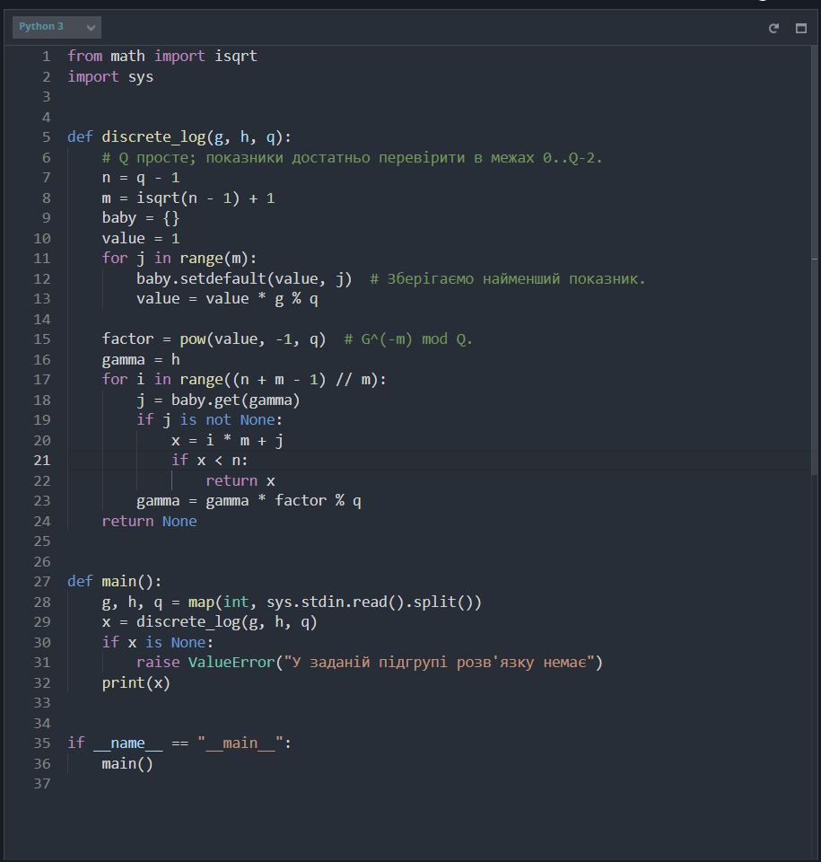

Рисунок 8.1 — Код Python-рішення в редакторі CodinGame

На рисунку 8.2 показано результати чотирьох видимих тестів: Test 1, Test 2, Test 3 і Test 4 позначено зеленим кольором. Це підтверджує успішну перевірку доступних прикладів на платформі.

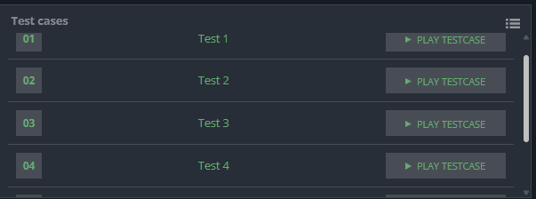

Рисунок 8.2 — Успішне проходження чотирьох видимих тестів CodinGame

Після відправлення отримано підсумкову оцінку 100%, наведену на рисунку 8.3. Скріншот підсумкового звіту підтверджує результат перевірки CodinGame. Кількість прихованих тестів та час виконання на сервері на зображенні не наведено; часові порівняння далі ґрунтуються на окремих локальних вимірюваннях.


Рисунок 8.3 — Підсумкова оцінка CodinGame 100% після відправлення рішення

## 6. Обчислювальні експерименти

### Методика вимірювання

Досліди виконано на одному процесі Python 3.12.14 у Windows із процесором Intel. Час вимірювався через time.perf_counter. Перед серією був один нетаймований прогрів. Для детермінованих алгоритмів виконано п’ять вимірювань, а для найдовших повних переборів - три. У таблицях наведено медіани; початкові зразки, мінімум і максимум збережено у docs/results/benchmark.json. Метод Полларда досліджено на 15 різних зернах для кожного розміру.

Підготовка простих чисел, основ і цілей не входить у таймер. У порівнянні повного перебору й BSGS ціль лежить біля кінця періоду, щоб ранній випадковий збіг не приховав різницю алгоритмів. Для порівняння Полларда з BSGS використано однакову підгрупу простого порядку й однаковий показник. Порядок цієї підгрупи задано обом алгоритмам. Під час таймованих ділянок автоматичний збирач циклічного сміття вимкнено; підрахунок пам’яті виконується окремо.

Сумарна тривалість завершеної серії з підготовкою та прогрівами становила 10,4 с, що вкладається у встановлений бюджет 600 с. Це реальні вимірювання. Вони не є часом серверів CodinGame і не дають підстав механічно прогнозувати швидкість криптографічних груп виробничого розміру. Фонове навантаження, версія інтерпретатора, кеші та представлення великих цілих чисел можуть змінювати результати.

### Повний перебір і BSGS

Зі збільшенням модуля з 12 до 24 біт повний перебір виконує дедалі більше послідовних множень. BSGS збільшує таблицю та число великих кроків приблизно як квадратний корінь із порядку. Медіани наведено в таблиці 8.3, а їх зміну показано на рисунку 8.4. Смуга навколо ліній відображає мінімальний і максимальний виміряний час.

Таблиця 8.3 — Порівняння повного перебору та BSGS

| Модуль, біт | Перебір, мс | BSGS, мс | Прискорення |
| --- | --- | --- | --- |
| 12 | 0,174 | 0,028 | 6,1× |
| 16 | 2,144 | 0,053 | 40,3× |
| 20 | 33,661 | 0,151 | 223,2× |
| 24 | 545,301 | 0,549 | 993,3× |


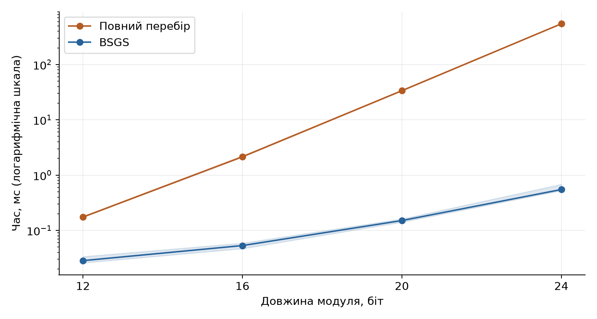

Рисунок 8.4 — Час повного перебору та BSGS для показника біля кінця періоду

Для 24-бітного випадку повний перебір виконав 8 389 160 модульних множень. BSGS виконав 5 792 множення в циклах малих і великих кроків. Лічильники на рисунку 8.5 не включають внутрішні множення функції pow, тест простоти чи доступ до словника, тому це опис основних циклів, а не повна кількість машинних інструкцій. Саме відмінність кількості циклічних кроків пояснює спостережуване прискорення.

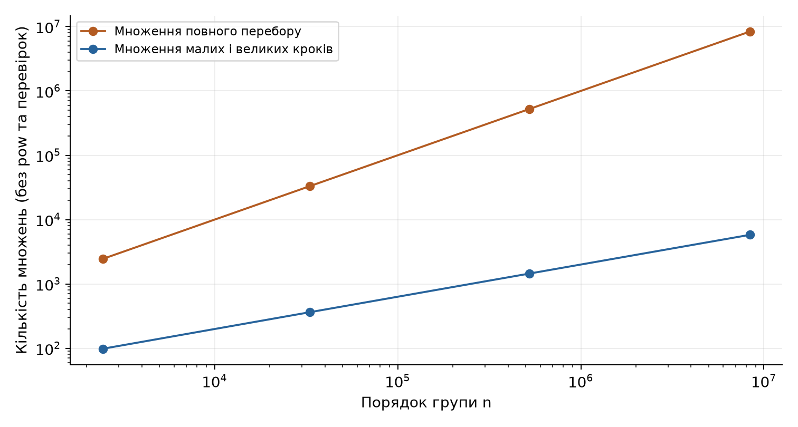

Рисунок 8.5 — Кількість модульних множень у головних циклах перебору та BSGS

Для модуля 49 999 999 967 та основи 5 ціль 43 999 999 971 дала показник 49 999 999 964. Мінімальний файл для CodinGame виконав цей пошук за медіанний час 69,326 мс, а інструментована реалізація бібліотеки - 76,882 мс. Таблиця містила 223 607 записів. Облік словника, його ключів і значень дав 22,78 MiB. Це не пікова пам’ять процесу, і порівнювати цю величину напряму з лімітом пам’яті платформи не можна.

### Однакова довжина та різний порядок

Для кожної довжини від 16 до 36 біт підготовлено два прості модулі. У першого порядок p - 1 містить тільки множники 2, 3, 5 і 7. Другий має вигляд p = 2r + 1, де r теж просте. В обох випадках використано первісну основу, тому її порядок дорівнює p - 1. Розмір модуля контролюється, а структура порядку змінюється.

Таблиця 8.4 — Поліг—Геллман для різної структури порядку групи

| Біт | Гладкий n, мс | n = 2r, мс | Відношення часу |
| --- | --- | --- | --- |
| 16 | 0,074 | 0,067 | 0,9× |
| 20 | 0,070 | 0,136 | 1,9× |
| 24 | 0,086 | 0,440 | 5,1× |
| 28 | 0,099 | 1,800 | 18,1× |
| 32 | 0,190 | 9,820 | 51,6× |
| 36 | 0,234 | 44,825 | 191,5× |


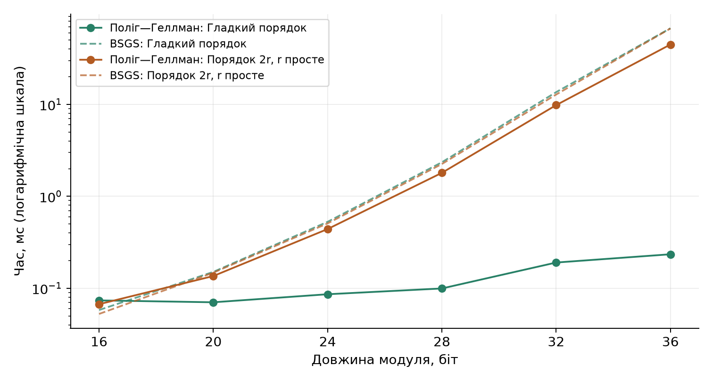

Рисунок 8.6 — BSGS та Поліг—Геллман для гладкого порядку й порядку з великим простим множником

Найбільша різниця спостерігається на 36 бітах. Для p = 34 527 510 529 порядок дорівнює 2²⁵·3·7³. Поліг—Геллман працює з підгрупами порядку 2, 3 і 7 та відновлює 29 цифр показника. Для p = 34 359 739 319 порядок дорівнює 2·17 179 869 659. Тут великий множник зберігає основну складність пошуку. Медіанні часи становлять 0,234 і 44,825 мс; відношення приблизно 191. Водночас BSGS для цих повних груп має близькі часи, бо він безпосередньо використовує величину порядку.

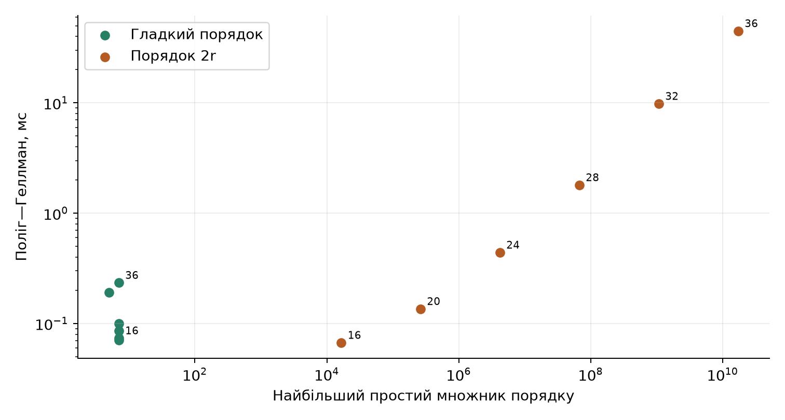

Рисунок 8.7 — Залежність часу Поліга—Геллмана від найбільшого простого множника порядку

На рисунку 8.7 горизонтальна вісь показує найбільший простий множник, а підписи біля точок - довжину відповідного модуля. Для гладких порядків величина цього множника залишається малою, хоча довжина зростає. Час усе ж дещо збільшується через більше число цифр і дорожчу арифметику. Малий модуль також показує накладні витрати: за 16 біт Поліг—Геллман може бути повільнішим за BSGS, оскільки розкладання та складання відповіді ще не компенсуються економією пошуку.

### Час та пам’ять методу Полларда

За p = 2r + 1 піднесення первісної основи до квадрата утворює основу підгрупи простого порядку r. Для цієї підгрупи порівняно BSGS із заданим порядком та метод Полларда. Результати наведено в таблиці 8.5. Час BSGS включає побудову словника; медіана Полларда отримана з 15 незалежних траєкторій.

Таблиця 8.5 — BSGS та метод Полларда в підгрупах простого порядку

| Модуль, біт | BSGS, мс | Поллард ρ, мс | Таблиця BSGS, MiB |
| --- | --- | --- | --- |
| 20 | 0,096 | 0,269 | 0,045 |
| 24 | 0,326 | 0,678 | 0,180 |
| 28 | 1,280 | 3,737 | 0,719 |
| 32 | 7,842 | 16,259 | 3,063 |
| 36 | 41,998 | 161,476 | 12,485 |


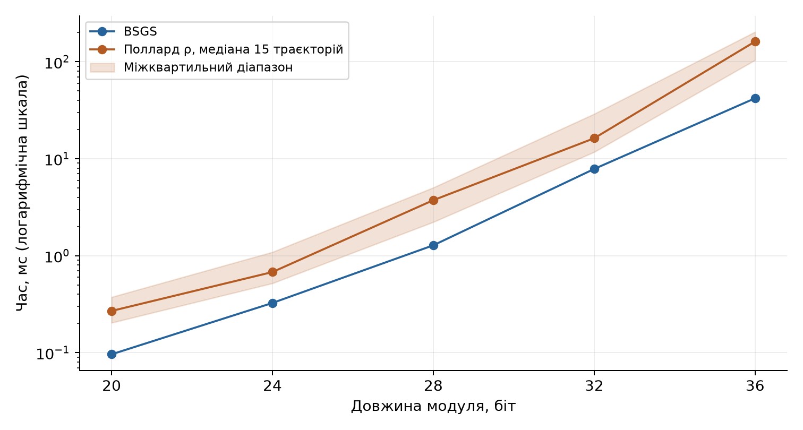

Рисунок 8.8 — Час BSGS та Полларда в підгрупах простого порядку

У 36-бітному випадку таблиця BSGS за окремим обліком об’єктів займає 12,48 MiB. Поллард обходиться фіксованою кількістю станів, проте в цій Python-реалізації його медіана дорівнює 161,476 мс проти 41,998 мс у BSGS. Один перехід Полларда оновлює не лише груповий елемент, а й два коефіцієнти; схема Флойда виконує три переходи за одну перевірку зіткнення. Через це менші вимоги до пам’яті не означають автоматично меншого часу.

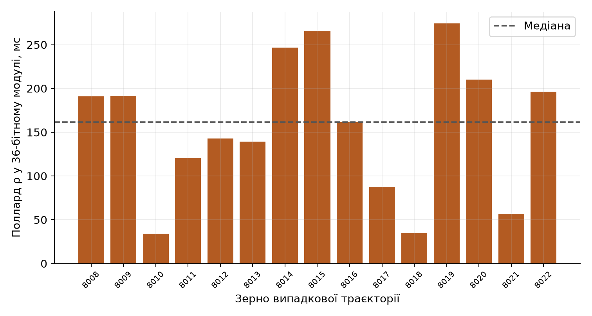

Рисунок 8.9 — Розкид часу 15 траєкторій Полларда для одного відкритого значення

Усі 15 траєкторій останнього випадку дали правильну відповідь. Проте час відрізняється залежно від зерна й місця зіткнення. Рисунок 8.9 тому доповнює медіану фактичним розкидом. Один вдалий або невдалий запуск не слід використовувати як єдину характеристику випадкового методу.

### Компроміс між пам’яттю і часом BSGS

Формула [(3)](#formula-3) допускає різні довжини блока m. Для одного 28-бітного модуля досліджено сім значень від приблизно однієї восьмої до восьми квадратних коренів із порядку. Показник і модуль залишалися незмінними. Медіани та окремий облік таблиці наведено в таблиці 8.6.

Таблиця 8.6 — Вплив розміру таблиці на час і пам’ять BSGS

| m / ⌈√n⌉ | Елементів m | Час, мс | Об’єкти, MiB |
| --- | --- | --- | --- |
| 1/8 | 1 448 | 16,704 | 0,148 |
| 1/4 | 2 896 | 5,162 | 0,295 |
| 1/2 | 5 793 | 2,792 | 0,591 |
| 1 | 11 586 | 2,362 | 1,181 |
| 2 | 23 172 | 2,669 | 2,488 |
| 4 | 46 344 | 4,883 | 4,975 |
| 8 | 92 688 | 9,143 | 9,950 |


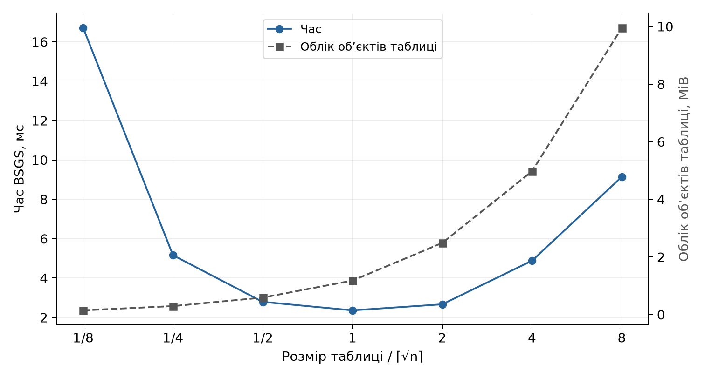

Рисунок 8.10 — Зміна часу та обсягу таблиці зі зміною довжини блока BSGS

Найменший виміряний час отримано поблизу m = ⌈√n⌉. За малої таблиці доводиться виконати більше великих кроків. За дуже великої таблиці дорожчає її побудова, тоді як подальший пошук уже короткий. Розмір словника зростає стрибками через внутрішнє виділення місткості. Облік пам’яті зроблено через sys.getsizeof словника та суму розмірів ключів і значень; він може враховувати спільні Python-об’єкти повторно й не включає решту процесу. Тому MiB у цій таблиці є однаково визначеною метрикою для порівняння варіантів.

### Повторне використання попередніх обчислень

Якщо модуль і основа незмінні, словник малих кроків однаковий для всіх відкритих значень h. Для 32-бітного модуля згенеровано двадцять різних показників із фіксованим зерном 8008. Порівняно незалежні повні запуски, одну побудову з усіма запитами та лише запити після вже виконаної побудови. Результати наведено в таблиці 8.7.

Таблиця 8.7 — Пошук двадцяти логарифмів зі спільною основою

| Спосіб виконання | Сумарний час, мс |
| --- | --- |
| Нова таблиця для кожного запиту | 182,855 |
| Одна побудова та двадцять запитів | 70,382 |
| Двадцять запитів після побудови | 66,269 |


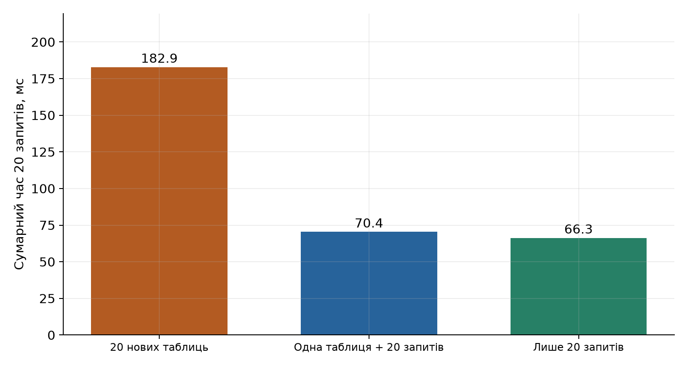

Рисунок 8.11 — Сумарний час двадцяти пошуків зі спільним модулем та основою

Повторне використання з урахуванням однієї побудови дало прискорення приблизно 2,60 раза. Третій стовпчик рисунка 8.11 виключає ціну побудови, тому його призначення - показати час наступних запитів. У чесному порівнянні повної роботи з двадцятьма цілями використовується другий варіант. Важливо також, що для нового модуля або нової основи таку таблицю треба створювати знову.

### Додаткові відомості про інтервал показника

За відомого інтервалу L..U можна помножити h на g⁻ᴸ і шукати лише зсув x - L. Розмір таблиці визначається кількістю кандидатів W = U - L + 1. Для того самого великого модуля 49 999 999 967 виконано чотири пошуки з відомим інтервалом, що закінчується правильним показником. Порівняння наведено в таблиці 8.8.

Таблиця 8.8 — Пошук у відомому інтервалі показників

| Кількість кандидатів W | Час, мс | Елементів таблиці |
| --- | --- | --- |
| 1 000 | 0,048 | 32 |
| 10 000 | 0,063 | 100 |
| 1 000 000 | 0,280 | 1 000 |
| 100 000 000 | 2,649 | 10 000 |


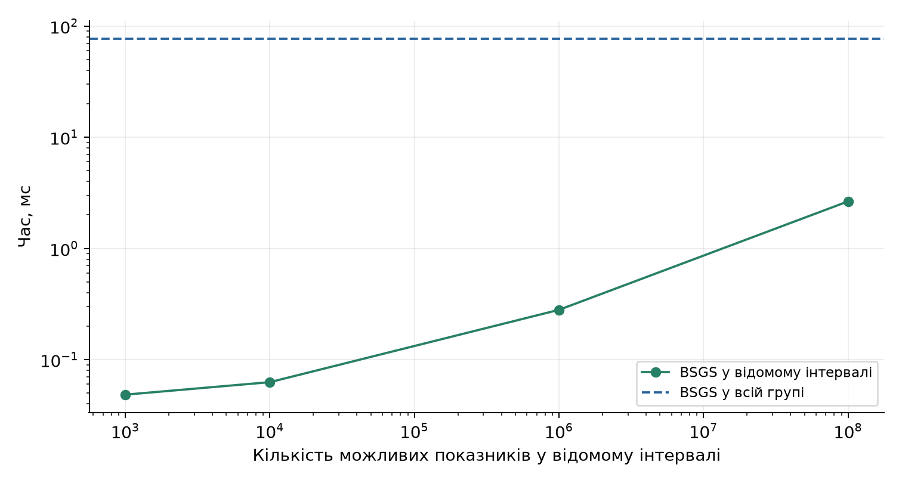

Рисунок 8.12 — Вплив відомої ширини інтервалу на час пошуку

Навіть за великого модуля короткий діапазон показника помітно скорочує пошук. Для W = 1000 достатньо 32 малих кроків. Це окрема модель знань про ключ: у вихідній умові CodinGame вузький інтервал не надається. Тому інтервальний результат не використовується для оцінки основного розв’язку. Він показує, чому передбачуване генерування приватних показників може зменшити фактичну складність атаки.

## 7. Відновлення ElGamal


Щоб пов’язати знайдений логарифм із шифруванням, створено власний синтетичний приклад ElGamal на 36-бітному модулі з гладким порядком. Обрано повідомлення M = 2026, приватний показник x = 123456789 і одноразовий показник k = 7654321. Відкритий ключ h обчислено як gˣ mod p. Шифротекст утворюється двома компонентами, наведеними у формулі [(7)](#formula-7) [6]:

<a id="formula-7"></a>

$$
c_1=g^k\bmod p,\quad c_2=Mh^k\bmod p\qquad\text{(7)}
$$

Алгоритм Поліга—Геллмана отримав лише g, h і p та відновив приватний показник. Значення повідомлення й одноразового показника не використовувалися для пошуку логарифма. Далі відновлений приватний показник дозволив обчислити спільний множник c₁ˣ та прибрати його з другої компоненти шифротексту. Розшифрування наведено у формулі [(8)](#formula-8):

<a id="formula-8"></a>

$$
M=c_2(c_1^x)^{-1}\bmod p\qquad\text{(8)}
$$

Таблиця 8.9 — Синтетичний приклад відновлення повідомлення ElGamal

| Величина | Фактичне значення |
| --- | --- |
| Модуль p і основа g | 34527510529; 13 |
| Відкритий ключ H | 25595900174 |
| Шифротекст c₁ | 12817517410 |
| Шифротекст c₂ | 23112437541 |
| Відновлений показник x | 123456789 |
| Початкове та відновлене M | 2026; 2026 |
| Поліг—Геллман, мс | 0,256 |


Отримане повідомлення збігається з початковим. Цей експеримент показує практичний наслідок слабкої структури порядку: втрата приватного показника дозволяє відновити зашифровані повідомлення. Він не є перевіркою сучасної реалізації ElGamal і не використовує чужих ключів. Модуль менший за 50 млрд має навчальний розмір; гладкість порядку додатково спрощує задачу.

## 8. Висновки та межі застосовності


Порівняння однакових довжин відділяє два фактори: величину групи та її структуру. BSGS без розкладання бачить період n і витрачає ресурси порядку його квадратного кореня. Поліг—Геллман бачить прості компоненти періоду й переносить пошук у них. Для гладких порядків із багатьма степенями малих простих чисел це набагато сильніше прискорення, ніж звичайна оптимізація циклу. Для порядку з великим простим множником найбільша компонента залишається складною.

Результат має межі застосовності. Для універсальних алгоритмів, які використовують тільки групові операції й не експлуатують особливостей представлення елементів, відомі нижні оцінки, пов’язані з квадратним коренем із найбільшого простого дільника порядку [5]. У скінченних полях існують також спеціалізовані методи, зокрема індексне числення. Тому оцінку квадратного кореня не можна називати безумовною нижньою межею для всіх атак на будь-яку дискретно-логарифмічну систему. Ця робота вимірює конкретні реалізації на навчальних параметрах.

Модуль виду 2r + 1 допомагає утворити підгрупу великого простого порядку, однак сам напис «безпечне просте» не доводить стійкість шифру. Потрібні достатній розмір, правильно вибрана підгрупа, належна перевірка відкритих елементів і непередбачуваний приватний показник. Стандарт NIST SP 800-56A описує перевірку параметрів та відкритих ключів для схем встановлення ключа на основі дискретного логарифма [7]. Локальний стенд не реалізує повний протокол встановлення ключа й не замінює такі перевірки.

Повторне використання таблиць та інтервальний пошук показали ще дві причини, через які оцінка лише одного запуску може бути неповною. Серія ключів у тій самій групі дозволяє розподілити ціну попередніх обчислень між багатьма цілями. Знання вузького інтервалу скорочує простір показників незалежно від довжини модуля. Метод Полларда, своєю чергою, показує, що обмеження пам’яті можуть змінити вибір алгоритму навіть за однакової асимптотичної кількості кроків.

### Підсумок

У роботі розв’язано задачу Discrete Log Problem методом малих і великих кроків. Рішення використовує не більше 223 607 записів таблиці й повертає найменший показник. Правильність підтверджено 57 локальними тестами, зокрема перевіркою 40 017 малих трійок та модуля біля верхньої межі. На CodinGame пройдено чотири видимі тести й отримано підсумкову оцінку 100%, зафіксовану на скріншотах.

Виконано реальні вимірювання чотирьох алгоритмів, а також досліди зі зміною розміру таблиці, повторними запитами та відомим інтервалом показника. Повний перебір швидко дорожчає зі збільшенням порядку. BSGS скорочує кількість кроків до квадратного кореня, а Поллард дозволяє уникнути великої таблиці ціною випадкового часу й дорожчих переходів у цій реалізації.

Найвиразніший результат отримано для двох 36-бітних модулів: Поліг—Геллман розв’язує гладкий випадок приблизно за 0,234 мс, а випадок з великим простим множником - за 44,825 мс. Синтетичне шифрування ElGamal підтвердило наслідок цього прискорення: приватний показник відновлено з відкритих параметрів, після чого розшифровано повідомлення 2026. Отже, під час оцінки складності дискретного логарифма слід враховувати порядок основи, його прості множники, доступні попередні обчислення та інформацію про приватний показник разом із довжиною модуля.

## 9. Відтворення результатів

```bash
python -m venv .venv
# Windows PowerShell
.venv\Scripts\Activate.ps1
# Linux / macOS
source .venv/bin/activate
python -m pip install -r requirements.txt
python -m pytest -q
python experiments/benchmark.py --seconds 600 --repeats 5
python experiments/plot_results.py
```

Вимірювання послідовні; зерна та параметри зафіксовано у JSON. Скрипт має бюджет часу й зберігає ознаку завершення серії. Він перезаписує локальний JSON новими результатами; після нового прогону графіки треба перебудувати. Час та висновки у README відповідають опублікованому зразку, тому після зміни даних їх також слід оновити. Числові лічильники алгоритмів відокремлено від часу та метрики об’єктів таблиці. Для Полларда вимірюються 15 траєкторій із зернами 8008–8022.

## 10. Список використаних джерел

1. CodinGame. Discrete Log Problem [Електронний ресурс]. - Режим доступу: https://www.codingame.com/training/hard/discrete-log-problem (дата звернення: 04.10.2026).

2. Menezes A., van Oorschot P., Vanstone S. Handbook of Applied Cryptography. Розділ 3. - CRC Press, 1996. - Режим доступу: https://cacr.uwaterloo.ca/hac/about/chap3.pdf (дата звернення: 04.10.2026).

3. Pohlig S., Hellman M. An Improved Algorithm for Computing Logarithms over GF(p) and Its Cryptographic Significance // IEEE Transactions on Information Theory. - 1978. - Vol. 24, No. 1. - P. 106-110. - Режим доступу: https://www-ee.stanford.edu/~hellman/publications/28.pdf (дата звернення: 04.10.2026).

4. Pollard J. Monte Carlo Methods for Index Computation (mod p) // Mathematics of Computation. - 1978. - Vol. 32, No. 143. - P. 918-924. - Режим доступу: https://doi.org/10.1090/S0025-5718-1978-0491431-9 (дата звернення: 04.10.2026).

5. Shoup V. Lower Bounds for Discrete Logarithms and Related Problems // Advances in Cryptology EUROCRYPT 1997. - P. 256-266. - Режим доступу: https://www.shoup.net/papers/dlbounds1.pdf (дата звернення: 04.10.2026).

6. Menezes A., van Oorschot P., Vanstone S. Handbook of Applied Cryptography. Розділ 8. - CRC Press, 1996. - Режим доступу: https://cacr.uwaterloo.ca/hac/about/chap8.pdf (дата звернення: 04.10.2026).

7. NIST. Recommendation for Pair-Wise Key-Establishment Schemes Using Discrete Logarithm Cryptography. SP 800-56A Revision 3. - 2018. - Режим доступу: https://csrc.nist.gov/pubs/sp/800/56/a/r3/final (дата звернення: 04.10.2026).

8. Python Software Foundation. Built-in Functions: pow. - Режим доступу: https://docs.python.org/3/library/functions.html#pow (дата звернення: 04.10.2026).

9. Гандзюк Д. LR8-DiscreteLog: код та результати експериментів [Електронний ресурс]. - Режим доступу: https://github.com/RE22GDV/LR8-DiscreteLog (дата звернення: 06.10.2026).
